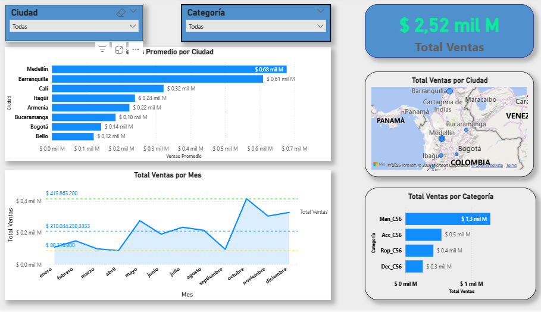

# 📊 Dashboard Financiero y Análisis de Negocio (Power BI)

## 📌 Contexto
El objetivo del proyecto es analizar el desempeño financiero y operativo de una empresa mediante un dashboard interactivo, facilitando la toma de decisiones basada en datos.

## 🔍 Análisis
Se trabajó con datos para:
- Evaluar ingresos, costos y rentabilidad
- Analizar tendencias en el tiempo
- Identificar segmentos o categorías clave
- Medir indicadores de desempeño (KPIs)

## 📈 Resultados
- Identificación de las principales fuentes de ingresos
- Detección de oportunidades de mejora en rentabilidad
- Visualización clara de tendencias y desempeño del negocio

## 🛠️ Herramientas
- Power BI
- DAX
- Power Query
- Data Visualization

## 📷 Dashboard

