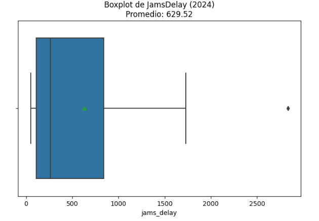
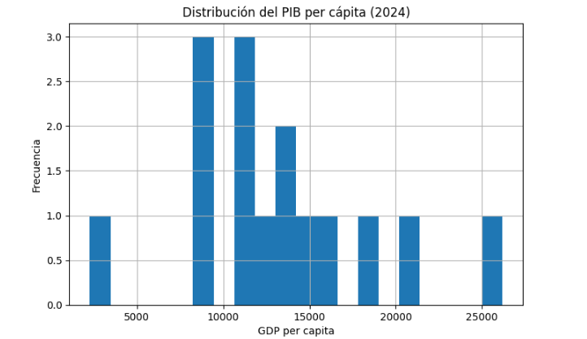

# 🐍 Análisis de Movilidad Urbana y Economía (Python)

## 📌 Contexto
El objetivo del proyecto es analizar datos de movilidad urbana y variables económicas para identificar patrones, tendencias y relaciones entre indicadores clave.

## 🔍 Análisis
Se utilizó Python para:
- Limpieza y preparación de datos (data cleaning)
- Análisis exploratorio (EDA)
- Transformación de variables
- Identificación de patrones en movilidad y economía

## 📈 Resultados
- Identificación de tendencias en indicadores de movilidad
- Análisis de variaciones entre ciudades/países
- Detección de posibles relaciones entre variables económicas y movilidad

## 🛠️ Herramientas
- Python
- Pandas
- Matplotlib / Seaborn
- Jupyter Notebook

## 📷 Visuales

